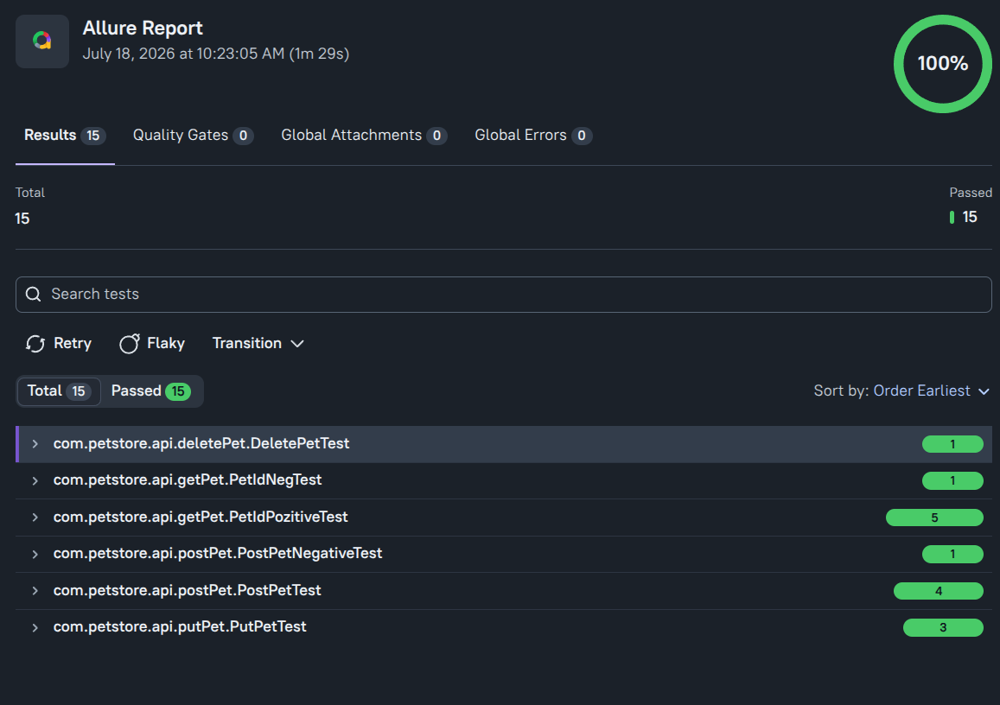

[](https://github.com/Nagraggini/petstore/actions/workflows/maven-tests.yml)


 


## REST API Tests: Swagger Petstore 

This repository contains an automated REST API test suite for the [Swagger Petstore API](https://petstore.swagger.io/).

The project demonstrates API testing using REST Assured, JUnit 5, Maven, Allure Report, and GitHub Actions CI/CD.

## Allure Test Report

📊 [View the Allure Report](https://nagraggini.github.io/petstore/)

## Toolbox

- Programming language: Java 21
- Test automation framework: JUnit 5
- API testing framework: REST Assured
- Reporting: Allure Report
- Build tool: Maven
- CI/CD: GitHub Actions

Requirements:
- JDK 21+
- Maven 3.x
- Internet connection
  
To run the tests, execute:

On Linux:
```./mvnw clean test```

On Windows:
```mvnw clean test```

To run a single test:                  

```./mvnw -Dtest=PetIdPozitiveTest#checkOnePet test```

## Covered Test Scenarios

- GET pet by ID
- POST create new pet
- PUT update existing pet
- DELETE pet
- HTTP status code validation
- Response body validation
- JSON schema/content validation
- Positive and negative test cases